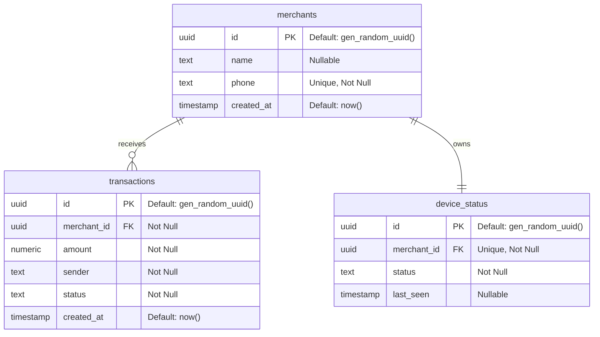

# Smart UPI Merchant Assistant - ER Diagram

This document illustrates the Entity-Relationship (ER) diagram for the Supabase database.

### Relationship Breakdown:
1. **merchants ↔ transactions**
   - **One-to-Many**: A single `merchant` can have many `transactions`.
   - The `merchant_id` in `transactions` is a foreign key referencing `merchants.id`.

2. **merchants ↔ device_status**
   - **One-to-One**: A single `merchant` currently maps to exactly one active `device_status` row tracking their ESP32 soundbox.
   - The `merchant_id` in `device_status` is a unique foreign key referencing `merchants.id`.
