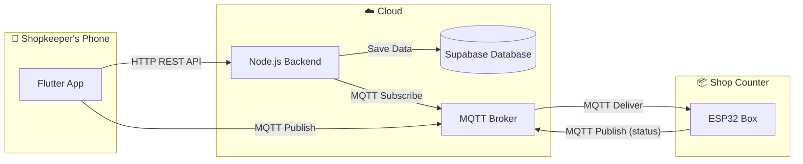
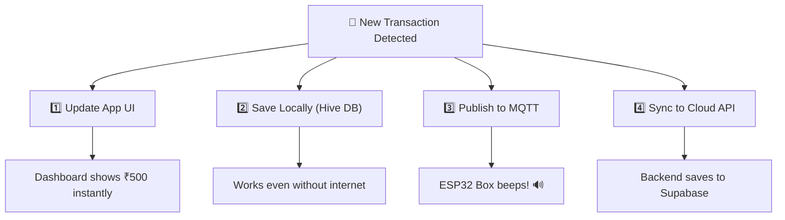
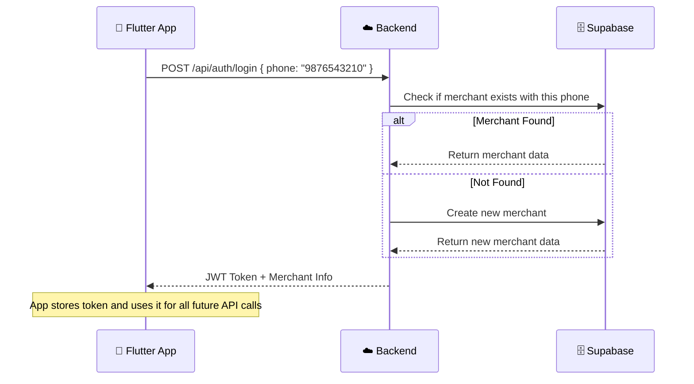
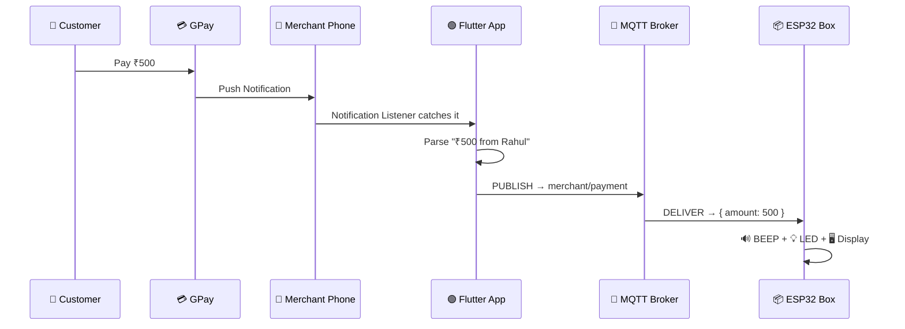
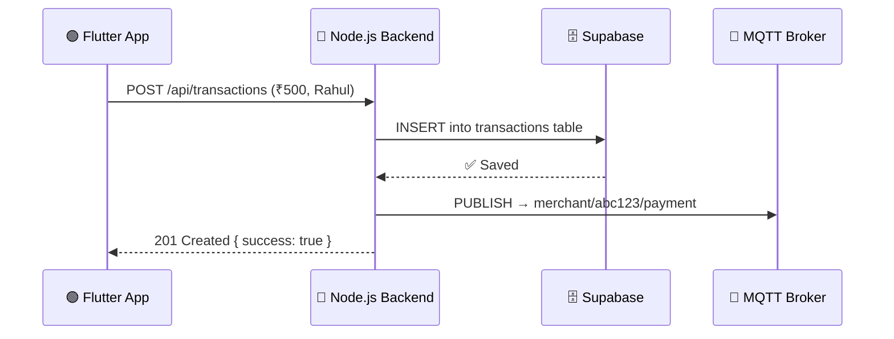
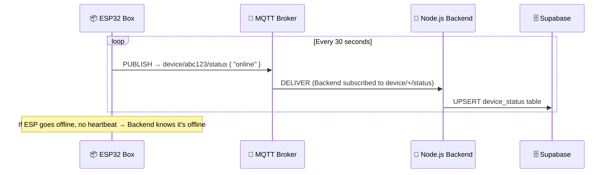
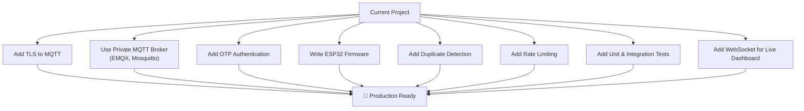

# 🧠 How the Smart Payment Box Works — The Complete Guide

> [!NOTE]
> This guide explains the **entire system** like you're 10 years old. No jargon. Just simple words, real examples, and cool diagrams.

---

## 📦 The 3 Main Players

Think of this project as a team of **3 friends** who work together to tell a shopkeeper "Hey! You got paid!":

| # | Player | What It Is | What It Does |
|---|--------|-----------|--------------|
| 🟢 | **Flutter App** (Android Phone) | An app on the shopkeeper's phone | Listens for payment notifications (GPay, PhonePe, Paytm), shows dashboard, sends data to backend |
| 🔵 | **Node.js Backend** (Cloud Server) | A server running on the internet | Saves payment data, talks to ESP32 via MQTT, provides dashboard analytics |
| 🟠 | **ESP32 Box** (Physical Hardware) | A small electronic box near the shop counter | Receives payment alerts and announces them (LED, buzzer, screen) |



---

## 📬 What is MQTT? (Explained Like You're 10)

### The WhatsApp Group Analogy

Imagine a **WhatsApp group** called `"Shop Payments"`:

- **MQTT Broker** = WhatsApp's Server (the middleman that delivers messages)
- **Topic** = The name of the group chat (like `merchant/payment`)
- **Publish** = Sending a message to the group
- **Subscribe** = Joining the group so you can read messages

Here's how it works:

```
🧑 You send a message to the group "Shop Payments"
        ↓
📡 WhatsApp server receives it
        ↓
👥 Everyone who JOINED that group gets the message
```

That's literally MQTT! Replace "WhatsApp server" with "MQTT Broker", and you've got it.

### Real MQTT Example in Your Project

```
📱 Flutter App PUBLISHES a message:
   Topic:   "merchant/abc123/payment"
   Message: { "amount": 500, "status": "success" }
        ↓
📡 MQTT Broker (HiveMQ) receives the message
        ↓
📦 ESP32 Box is SUBSCRIBED to "merchant/abc123/payment"
   → It receives the message
   → It beeps! 🔊
   → It shows "₹500 Received!" on screen 🖥️
```

### Key MQTT Terms — Super Simple

| Term | Simple Meaning | Example |
|------|---------------|---------|
| **Broker** | The postman/middleman server | `broker.hivemq.com` (a free public one) |
| **Topic** | An "address" or "channel name" — like a mailbox label | `merchant/abc123/payment` |
| **Publish** | Send a message to a topic | App sends `₹500 received` to the topic |
| **Subscribe** | Listen/watch a topic for new messages | ESP32 watches the payment topic |
| **QoS** | Quality of Service — how careful the delivery is | QoS 0 = "maybe", QoS 1 = "at least once", QoS 2 = "exactly once" |
| **Client ID** | A unique name so the broker knows who you are | `flutter_merchant_client`, `esp32_device_001` |

### Why MQTT and Not HTTP?

| Feature | HTTP (like loading a website) | MQTT (like a walkie-talkie) |
|---------|------|------|
| Who starts talking? | Client asks server, server replies | Anyone can send anytime |
| Speed | Slower (request → response) | Super fast (instant push) |
| Power usage | Uses more battery | Very light on battery |
| Best for | Loading web pages, APIs | IoT devices, real-time alerts |
| Connection | Opens and closes each time | Stays connected (always ready) |

**In simple words:** HTTP is like calling someone on the phone — you call, they answer, you hang up. MQTT is like a walkie-talkie — everyone is always connected and can talk anytime.

---

## 🔄 The Complete Payment Flow — Step by Step

Let's walk through what happens when a **customer pays ₹500 via GPay** to the shopkeeper:

### Step 1: 💰 Customer Pays via GPay

The customer opens GPay and sends ₹500 to the shopkeeper's UPI ID.

```
Customer's Phone → GPay → ₹500 → Shopkeeper's UPI
```

### Step 2: 📱 Phone Gets a Notification

The shopkeeper's Android phone gets a notification from GPay:

```
"₹500.00 received from Rahul"
```

### Step 3: 🔔 Flutter App Catches the Notification

Your app uses Android's **Notification Listener Service** to read incoming notifications. The [NotificationService](file:///d:/Projects_Extended/Smart-Payment-Box/Flutter-App/lib/services/notification_service.dart) catches it:

```dart
// The Android system sends notification data to the Flutter app
// through a platform channel (EventChannel)
void _onEvent(dynamic event) {
  final packageName = data['packageName']; // "com.google.android.apps.nbu.paisa.user"
  final text = data['text'];               // "₹500.00 received from Rahul"
  
  // Parse it into a Transaction object
  final transaction = NotificationParser.parseNotification(packageName, title, text);
}
```

### Step 4: 🔍 Notification Parser Extracts the Data

The [NotificationParser](file:///d:/Projects_Extended/Smart-Payment-Box/Flutter-App/lib/core/notification_parser.dart) uses regex to pull out the amount and sender name:

```dart
// Input:  "₹500.00 received from Rahul"
// Output: Transaction(amount: 500.0, senderName: "Rahul", status: "success", sourceApp: "GPay")
```

It can parse notifications from:
- ✅ **Google Pay** (`com.google.android.apps.nbu.paisa.user`)
- ✅ **PhonePe** (`com.phonepe.app`)
- ✅ **Paytm** (`net.one97.paytm`)

### Step 5: 💾 Payment Provider Does 4 Things at Once

The [PaymentNotifier](file:///d:/Projects_Extended/Smart-Payment-Box/Flutter-App/lib/providers/payment_provider.dart) is the brain. When it gets a new transaction, it does 4 things:



#### 5a. Update UI State
```dart
state = [tx, ...state]; // Add new transaction to the top of the list
```

#### 5b. Save to Local Storage (Offline Support)
```dart
await localDb.savePayment(tx.toJson()); // Save to Hive (local database)
```

#### 5c. Publish to MQTT → This tells the ESP32!
```dart
mqtt.publishPayment('{"amount": 500, "sender": "Rahul", "status": "success"}');
// This sends the message to topic: "merchant/payment"
```

#### 5d. Sync to Cloud Backend
```dart
await api.postPaymentData(tx.toJson()); // POST to https://your-server.com/api/transactions
```

### Step 6: 📡 MQTT Broker Receives & Delivers

The MQTT Broker (HiveMQ) receives the payment message from the Flutter app and delivers it to anyone subscribed to the topic:

```
Flutter App → PUBLISHES → "merchant/payment" → { amount: 500, sender: "Rahul" }
                                    ↓
                           MQTT Broker (HiveMQ)
                                    ↓
              ESP32 Box ← SUBSCRIBED to "merchant/payment"
              Backend   ← SUBSCRIBED to "device/+/status"
```

### Step 7: 📦 ESP32 Box Reacts!

The ESP32 (which you program with Arduino/MicroPython) is always connected to the MQTT broker. When it receives the message:

```
ESP32 receives: { "amount": 500, "sender": "Rahul", "status": "success" }

→ 💡 Green LED turns ON
→ 🔊 Buzzer plays a "cha-ching!" sound
→ 🖥️ OLED display shows: "₹500 from Rahul"
→ After 5 seconds → LED off, display clears, waits for next payment
```

### Step 8: ☁️ Backend Saves Everything

Meanwhile, the [Backend](file:///d:/Projects_Extended/Smart-Payment-Box/Backend/src/controllers/transactionController.js) receives the REST API call from the Flutter app:

```javascript
// POST /api/transactions
// Body: { amount: 500, sender: "Rahul", status: "success" }

// 1. Save to Supabase database
await supabase.from('transactions').insert([
  { merchant_id: "abc123", amount: 500, sender: "Rahul", status: "success" }
]);

// 2. Also publish to MQTT (so ESP32 gets it from backend too)
mqttClient.publishMessage('merchant/abc123/payment', { amount: 500, status: "success" });
```

### Step 9: 📊 Dashboard Shows Analytics

The shopkeeper opens the dashboard in the app. The [Dashboard Controller](file:///d:/Projects_Extended/Smart-Payment-Box/Backend/src/controllers/dashboardController.js) calculates:

- ✅ Today's total earnings
- ✅ Total number of successful transactions
- ✅ Average transaction amount

---

## 🗂️ MQTT Topic Structure

Topics are like **folders** or **channels**. Here's how they're organized in your project:

```
MQTT Topics (like folder structure):
─────────────────────────────────────
merchant/
├── {merchant_id}/
│   └── payment        ← Payment alerts go here (App → ESP32)
│
device/
├── {merchant_id}/
│   └── status         ← Device online/offline status (ESP32 → Backend)
│
merchant/
└── status             ← Will Topic: sent when Flutter app goes offline
```

| Topic | Who Publishes? | Who Subscribes? | What's the Message? |
|-------|---------------|-----------------|---------------------|
| `merchant/{id}/payment` | Flutter App + Backend | ESP32 Box | `{ amount: 500, status: "success" }` |
| `device/{id}/status` | ESP32 Box | Backend | `{ status: "online" }` |
| `merchant/status` | Flutter App (auto, on disconnect) | Backend | `"offline"` |

### What does `device/+/status` mean?

The `+` is a **wildcard**! It means "any value in this position":

```
device/+/status  matches:
  ✅ device/abc123/status
  ✅ device/xyz789/status
  ✅ device/ANY_MERCHANT_ID/status
```

So the backend can listen to ALL devices' status updates with just one subscription!

---

## 🗄️ Database Structure (Supabase)

Three tables store everything:

```mermaid
erDiagram
    merchants ||--o{ transactions : "has many"
    merchants ||--|| device_status : "has one"

    merchants {
        uuid id PK
        text name
        text phone UK
        timestamp created_at
    }

    transactions {
        uuid id PK
        uuid merchant_id FK
        numeric amount
        text sender
        text status
        timestamp created_at
    }

    device_status {
        uuid id PK
        uuid merchant_id FK_UK
        text status
        timestamp last_seen
    }
```

---

## 🔐 How Authentication Works



---

## 🔌 ESP32 — What It Would Do (Hardware Side)

Since the ESP32 code isn't in the repo yet, here's what it **should** do:

```
ESP32 Program Pseudocode:
─────────────────────────
1. Connect to WiFi
2. Connect to MQTT Broker (broker.hivemq.com:1883)
3. Subscribe to topic: "merchant/YOUR_MERCHANT_ID/payment"
4. Every 30 seconds → Publish to topic: "device/YOUR_MERCHANT_ID/status"
   → Message: { "status": "online" }

5. LOOP FOREVER:
   - Wait for MQTT message...
   - When message arrives:
     - Parse JSON: { amount: ₹500, sender: "Rahul" }
     - Turn on GREEN LED for 3 sec
     - Play BUZZER beep
     - Show on OLED: "₹500 from Rahul"
     - Wait 5 seconds
     - Clear display
```

```
Hardware You'll Need:
─────────────────────
┌──────────────┐
│   ESP32      │──── OLED Display (SSD1306, 0.96")
│   DevKit     │──── Buzzer (active buzzer, 3.3V)
│              │──── Green LED + 220Ω resistor
│              │──── Power: USB cable or battery pack
└──────────────┘
```

---

## 🌊 Complete Data Flow Summary

````carousel
### Flow 1: Payment Detection → ESP32 Alert


<!-- slide -->
### Flow 2: Payment Sync → Cloud Storage


<!-- slide -->
### Flow 3: ESP32 Heartbeat (Device Status)


````

---

## ⚠️ Project Limitations

> [!CAUTION]
> These are important limitations to be aware of before deploying this project in a real shop.

### 🔴 Critical Limitations

| # | Limitation | Why It Matters |
|---|-----------|----------------|
| 1 | **No Real UPI Integration** | The app doesn't actually process payments. It only **reads notifications** from other apps (GPay, PhonePe, Paytm). If those apps change their notification format, parsing breaks. |
| 2 | **Public MQTT Broker (HiveMQ)** | You're using a **free public broker** — anyone in the world can subscribe to your topics and see your payment data! This is a **major security risk** for production. |
| 3 | **No MQTT Encryption** | Messages are sent over `mqtt://` (port 1883) which is **unencrypted**. Anyone can sniff the data. Production needs `mqtts://` (port 8883) with TLS. |
| 4 | **Mock Authentication** | Login is done via phone number only — **no OTP, no password, no verification**. Anyone who knows a phone number can log in. |
| 5 | **Notification Listener Fragility** | Android can kill the notification listener service in the background. Different phone brands (Xiaomi, Samsung, Oppo) have aggressive battery optimization that may block this service. |

### 🟡 Moderate Limitations

| # | Limitation | Why It Matters |
|---|-----------|----------------|
| 6 | **No ESP32 Code in Repo** | The hardware side isn't implemented yet. You'd need to write Arduino/ESP-IDF code yourself. |
| 7 | **No Duplicate Payment Detection** | If GPay sends 2 notifications for the same payment (which happens sometimes), the system will count it as 2 payments. |
| 8 | **No Multi-Device Support** | The MQTT topic structure assumes one ESP32 per merchant. Can't easily have multiple boxes per shop. |
| 9 | **No Offline Queue for MQTT** | If the phone has no internet, MQTT messages are not queued. The ESP32 won't beep for payments received while offline. |
| 10 | **No Rate Limiting** | The backend doesn't have rate limiting. Someone could spam the API and create fake transactions. |
| 11 | **Single Regex Parser Per App** | The notification parser uses hardcoded regex patterns. Different languages (Hindi, Tamil) or different notification formats will not be parsed. |

### 🟢 Minor Limitations

| # | Limitation | Why It Matters |
|---|-----------|----------------|
| 12 | **No Push Notifications** | The app doesn't send push notifications to the merchant. It relies on them having the app open or the ESP32 box alerting them. |
| 13 | **No Transaction Editing/Deletion** | Once a transaction is saved, there's no way to edit or delete it from the app. |
| 14 | **No Multi-Currency Support** | Only Indian Rupees (₹) are supported. The regex specifically looks for the ₹ symbol. |
| 15 | **No Unit Tests** | There are no automated tests for the backend or the Flutter app. |
| 16 | **Dashboard Fetches All Records** | The `getDashboardAnalytics` function fetches ALL successful transactions to calculate totals. This will slow down as data grows — needs database-level aggregation. |
| 17 | **No WebSocket for Real-Time Dashboard** | The Flutter app dashboard doesn't auto-refresh. The merchant has to manually refresh to see new payments reflected in analytics. |

### 🏗️ What It Would Take to Make This Production-Ready



---

## 🧪 Quick Reference: All API Endpoints

| Method | Endpoint | What It Does | Auth Required? |
|--------|----------|-------------|----------------|
| `POST` | `/api/auth/login` | Login with phone number, get JWT token | ❌ No |
| `POST` | `/api/transactions` | Save a new payment transaction | ✅ Yes |
| `GET` | `/api/transactions` | Get transaction history (paginated) | ✅ Yes |
| `GET` | `/api/transactions/export` | Download transactions as Excel file | ✅ Yes |
| `GET` | `/api/dashboard` | Get dashboard analytics (today's total, avg, count) | ✅ Yes |
| `GET` | `/api/device/status` | Get ESP32 device online/offline status | ✅ Yes |
| `POST` | `/api/device/status` | Manually update device status | ✅ Yes |
| `GET` | `/health` | Server health check | ❌ No |

---

## 🎯 TL;DR — One Paragraph Summary

> A customer pays via GPay/PhonePe/Paytm → the shopkeeper's Android phone gets a notification → the Flutter app catches that notification and extracts the amount & sender name → it instantly sends this data to an **MQTT broker** (a message delivery service) → the **ESP32 box** on the shop counter is always listening on that MQTT channel, so it immediately receives the payment info and **beeps + shows it on screen** → meanwhile, the app also sends the data to the **Node.js backend** which saves it to **Supabase** for dashboard analytics and history → the ESP32 also periodically tells the backend "I'm alive!" through MQTT so the app can show if the box is online or offline.
